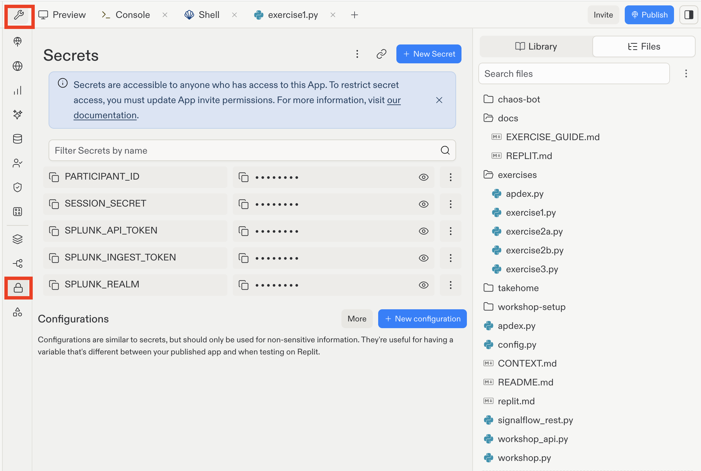

# Replit Setup

Use this path for the default in-room workshop flow. If Replit is blocked by
your laptop, browser, or company policy, use the Splunk Show SSH/CLI fallback in
[`docs/SPLUNK_SHOW.md`](SPLUNK_SHOW.md).

Replit runs Python in your browser. You do not need to install Python locally,
but you do need a Replit account and the workshop handout. Your Replit
credentials, Splunk Observability Cloud login, and O11y token values are
different things. The handout does not print token values; you copy them from
Splunk Observability Cloud after signing in. Do not paste O11y passwords or
token values into the Replit Agent chat.

## Start From The Workshop Repo

1. Sign in to Replit and go to your Replit home: [https://replit.com/~](https://replit.com/~).
2. Choose **Import code or design**.
3. Under **Import to Replit**, choose **GitHub**.
4. Under **Import from GitHub**, enter the workshop repo URL: `https://github.com/PKing70/signalflow101-conf26`.
5. Confirm the suggested Repl name is `signalflow101-conf26` and that you are the owner, then choose **Import from GitHub**.
6. Wait for Replit to finish importing the project.
7. When the project opens, Replit may show an Agent panel asking what you want to do with the project. Close the Agent panel with **X** or ignore it. Do not paste workshop secrets into the Agent chat.
8. The right side may say **Your app is not running**. That is expected. You are in the right place.

If you already imported the repo earlier, use Replit's Git tools to pull the latest `main` branch before continuing.

## Add Your Workshop Values

In Replit, use **Secrets**. Replit may already show a secret named `SESSION_SECRET`. Leave it alone. You will add four more secrets for this workshop.



1. From the left side of Replit, open **Tools**.
2. Choose **Secrets**.
3. Choose **+ New Secret**.
4. Add these secrets one at a time. For each one, fill out **Key** and **Value**, then choose **Add Secret**.

Important: copy token values/secrets from Splunk Observability Cloud, not token
IDs. Token IDs identify the token in Splunk O11y; token values are what Python
uses to authenticate. See [`docs/O11Y.md`](O11Y.md) for the O11y sign-in and
token-copy steps.

| Replit Secret | Value Source |
|---|---|
| `SPLUNK_REALM` | Everyone uses `us1` |
| `SPLUNK_INGEST_TOKEN` | O11y **Settings > Access Tokens**; copy the workshop ingest token value with `INGEST` authorization scope |
| `SPLUNK_API_TOKEN` | O11y **Settings > Access Tokens**; copy the workshop API token value with `API` authorization scope |
| `PARTICIPANT_ID` | From your workshop handout, for example `participant-345` |

Use the ingest token value for `SPLUNK_INGEST_TOKEN` and the API token value for
`SPLUNK_API_TOKEN`. If you accidentally use the ingest token for both, Exercise
1 and Exercise 2a might send metrics, but Exercise 2b will fail with an
unauthorized SignalFlow error.

Do not paste secrets into Python files, chat windows, screenshots, or the public repo.

The example `participant-345` is only an example. `PARTICIPANT_ID` is not copied
from O11y or Splunk Show; use the exact value assigned to you by workshop staff.

## Verify Setup

Run the setup check before starting the exercises. Replit's UI changes
frequently. The most reliable way to open Workflows is:

1. Press **Cmd+K** on Mac or **Ctrl+K** on Windows.
2. Search for `Workflows`.
3. Choose **Workflows** from the results.
4. Run `0 - Check setup`.
5. Press **Cmd+K** or **Ctrl+K**, search for `Console`, and open **Console** to see the workflow output.

Expected setup check output:

```text
SignalFlow 101 setup check

Python: 3.12.12

Packages:
  OK      requests
  OK      python-dotenv
  OK      fastapi
  OK      uvicorn

Workshop values:
  OK      SPLUNK_REALM
  OK      SPLUNK_INGEST_TOKEN with INGEST scope
  OK      SPLUNK_API_TOKEN with API scope
  OK      PARTICIPANT_ID

Ready. Start the API, then start sending latency metrics.
Note: this setup check verifies presence, not live token authorization.
```

After setup passes, go to [`docs/EXERCISE_GUIDE.md`](EXERCISE_GUIDE.md). The
exercise guide tells you which Replit workflow to run for each timed step.
Use [`docs/O11Y.md`](O11Y.md) when the exercise guide tells you to verify your
metrics in Splunk Observability Cloud.

## Troubleshooting

**Setup check says values are missing:** Open **Tools > Secrets** and confirm the names match exactly. Replit Secrets are case-sensitive.

**You see `participant-unconfigured`:** `PARTICIPANT_ID` is missing or still set to a placeholder. Set it to your assigned alias, such as `participant-042`.

**The setup workflow does not appear:** Replit sometimes needs a workspace
reload after importing `.replit`. Reload the browser tab or restart the
workspace, then press **Cmd+K** or **Ctrl+K** and search for `Workflows` again.
